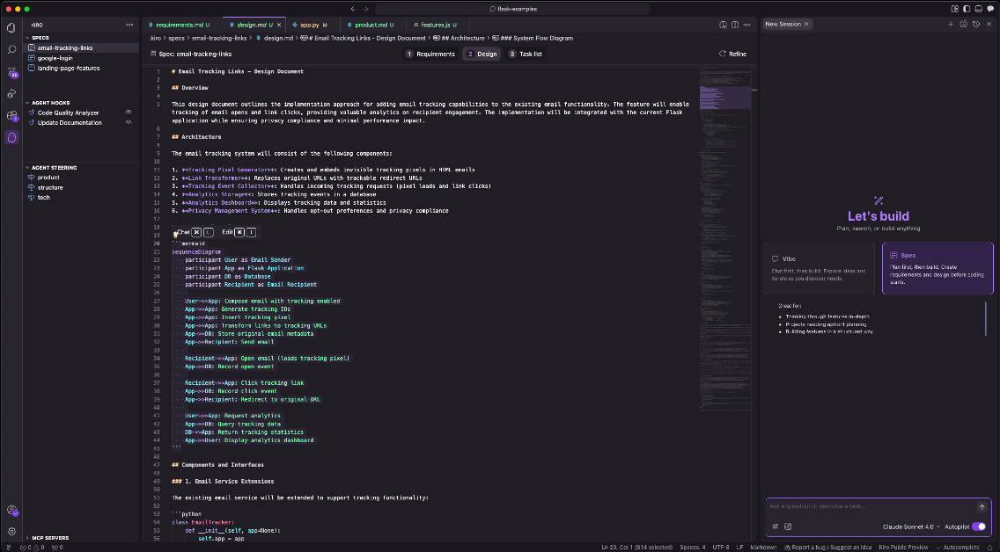
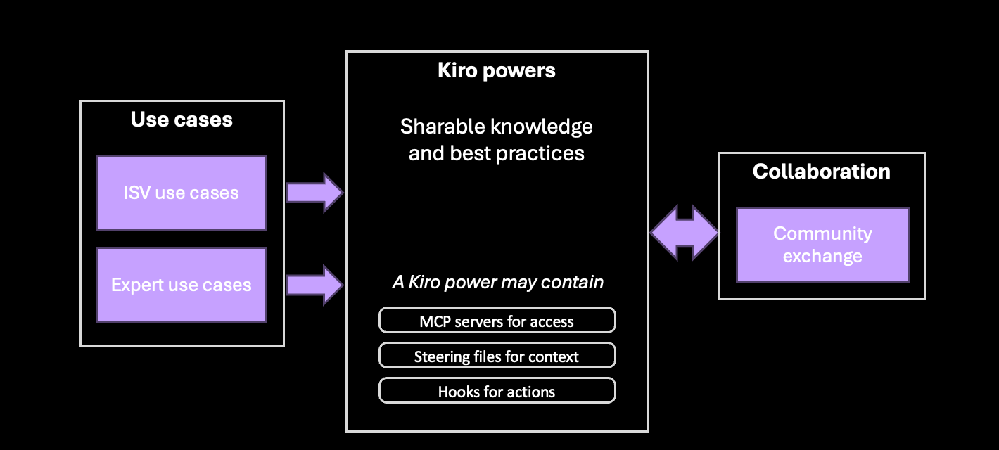
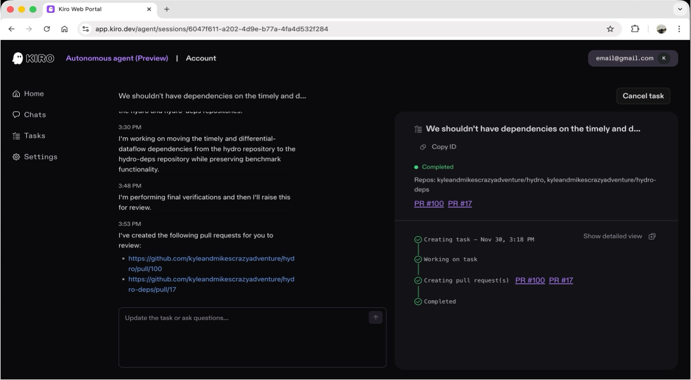
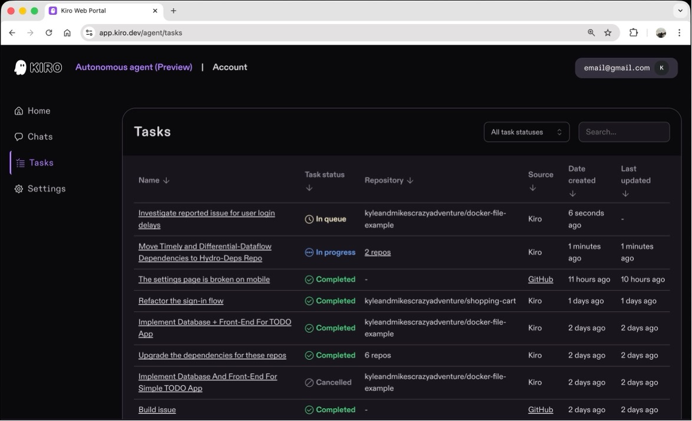
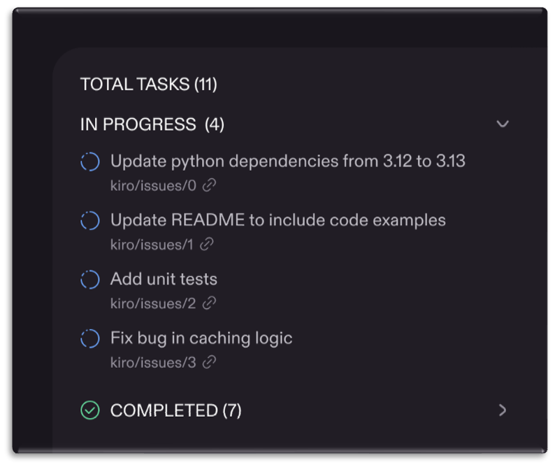
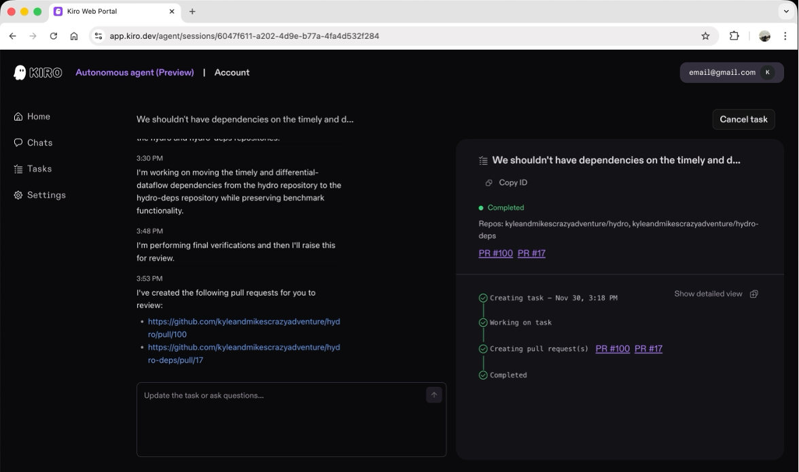

# Kiro Workshop

---

<!-- _class: agenda -->
<style scoped>
section { padding-top: 40px; }
h1 { margin-bottom: 10px; }
td { background: transparent; color: #f0f0f0; }
</style>

# Agenda

<div style="font-size: 0.34em;">

| Time | Topic |
|------|-------|
| 9:30 | Introductions |
| 9:45 | The Challenge & Developer Responsibility |
| 10:00 | The Renaissance Developer |
| 10:15 | Enter Kiro + Demo |
| 11:00 | ☕ Break |
| 11:15 | **Guided Workshop (Part 1)** |
| 12:00 | 🍽️ Lunch |
| 13:00 | **Guided Workshop (Part 2)** |
| 14:30 | Portbase Guidelines + Q&A |
| 15:00 | End |

</div>

<!--
FACILITATOR NOTES:
- Morning = theory (9:30-11:00), afternoon = hands-on (11:15-14:30)
- Guided workshop builds a Notes Webapp using spec-driven development
- Break times are flexible ±10 min
- Portbase Guidelines: customize before workshop with customer-specific do's/don'ts
-->

---

# Introduce Yourself

One challenge you've faced with AI coding tools

<!--
FACILITATOR NOTES:
- Go around the room, 30 seconds each
- Write down common challenges on whiteboard
- Common answers: context loss, inconsistent output, no docs, wrong patterns
- Use these pain points to connect to Part 1
-->

---

# Workshop Goal

**Build a Notes Webapp using spec-driven development**

<style scoped>
ul { font-size: 0.6em; margin-top: 20px; }
li { margin-bottom: 10px; }
</style>

**Guided Workshop** — we build together, step by step

- Understand the spec-driven workflow (Requirements → Design → Tasks)
- Use Kiro to generate and implement specifications
- Experience AI-assisted development with human oversight
- Deploy a working application by end of day

<!--
FACILITATOR NOTES:
- Emphasize "guided" - they won't be lost
- Notes Webapp = simple but realistic project
- Spec-driven = the key differentiator from vibe coding
- By end of day: working app they built themselves
-->

---

<!-- _class: lead -->

# The Challenge

<!--
FACILITATOR NOTES:
- Start with the big picture: AI is evolving
- Then zoom into concrete problems
- Connect to challenges they shared in intro
-->

---

# AI is Changing Software

<style scoped>
.boxes { display: flex; gap: 20px; margin-top: 20px; }
.box { flex: 1; background: #1a1a1a; padding: 20px; border-radius: 8px; }
.box h3 { margin: 0 0 5px 0; }
.box h2 { margin: 0 0 10px 0; font-size: 1.1em; }
.box p { margin: 0; font-size: 0.75em; line-height: 1.4; }
.past { border-top: 4px solid #9933FF; }
.past h3, .past h2 { color: #9933FF; }
.current { border-top: 4px solid #9933FF; }
.current h3, .current h2 { color: #9933FF; }
.future { border-top: 4px solid #9933FF; }
.future h3, .future h2 { color: #9933FF; }
</style>

<div class="boxes">
<div class="box past">
<h3>2024</h3>
<h2>ASSISTANTS</h2>
<p>Helping developers write code faster</p>
</div>
<div class="box current">
<h3>2025</h3>
<h2>AGENTS</h2>
<p>Completing development tasks end-to-end with human in the loop</p>
</div>
<div class="box future">
<h3>2026</h3>
<h2>AUTONOMY</h2>
<p>Completing development tasks end-to-end with bounded independence</p>
</div>
</div>

<!--
FACILITATOR NOTES:
- Draw attention to "We are HERE" - this is the transition point
- 2024: AI as autocomplete and Q&A (reactive)
- 2025: AI as autonomous executor (proactive)
- 2026+: AI as autonomous developer (self-directed)
-->

---

# Example: 2024 ASSISTANTS

<style scoped>
p, ul, li { font-size: 0.8em; line-height: 1.3; margin: 5px 0; }
</style>

**Task:** "Write a login function"

**Flow:**
- Developer asks AI for code
- AI suggests code snippet
- Developer manually integrates snippet
- Developer writes tests
- Developer updates documentation
- Developer handles error cases

**Result:** *Human does most work, AI helps with snippets*

---

# Example: 2025 AGENTS

<style scoped>
p, ul, li { font-size: 0.8em; line-height: 1.3; margin: 5px 0; }
</style>

**Task:** "Add JWT authentication with refresh tokens"

**Flow:**
- AI generates requirements → **Human approves**
- AI designs architecture → **Human approves**
- AI implements complete feature (handlers, validation, tests, docs)
- AI runs tests and reports results
- **Human reviews & merges**

**Result:** *Agent does end-to-end work, human controls checkpoints*

---

# Example: 2026 AUTONOMY

<style scoped>
p, ul, li { font-size: 0.8em; line-height: 1.3; margin: 5px 0; }
</style>

**Task:** "Users report slow login"

**Flow:**
- AI autonomously investigates performance issue
- AI proposes optimization approach
- AI implements fix across multiple files
- AI runs full test suite
- AI creates pull request with detailed explanation
- **Human reviews final PR**

**Result:** *AI works independently with minimal oversight*

---

# The Promise of Agentic Development

<style scoped>
.boxes { display: flex; gap: 15px; margin-top: 15px; }
.box { flex: 1; background: #1a1a1a; padding: 15px; border-radius: 8px; }
.box h2 { margin: 0 0 8px 0; font-size: 0.9em; color: #9933FF; }
.box p { margin: 0; font-size: 0.6em; line-height: 1.3; }
</style>

<div class="boxes">
<div class="box">
<h2>Autonomy</h2>
<p>Agents can take on and complete increasingly challenging tasks autonomously</p>
</div>
<div class="box">
<h2>True Collaboration</h2>
<p>Developers and agents work together to get more done</p>
</div>
<div class="box">
<h2>Higher Quality</h2>
<p>Agents handle the heavy lifting of increasing test coverage, documenting code, optimizing performance, fixing security vulnerabilities</p>
</div>
</div>

<!--
FACILITATOR NOTES:
- This is the "promise" slide - paint the vision
- Autonomy: No more babysitting every line of code
- Collaboration: Human creativity + AI speed
- Quality: AI doesn't forget standards or skip tests
-->

---

# Developers Stay Responsible

<style scoped>
.boxes { display: flex; gap: 15px; margin-top: 15px; }
.box { flex: 1; background: #1a1a1a; padding: 15px; border-radius: 8px; }
.box h2 { margin: 0 0 8px 0; font-size: 0.9em; color: #9933FF; }
.box p { margin: 0; font-size: 0.6em; line-height: 1.3; }
</style>

<div class="boxes">
<div class="box">
<h2>AI Assists, You Decide</h2>
<p>AI generates suggestions and implementations — humans review, approve, and own the final code</p>
</div>
<div class="box">
<h2>Accountability Remains</h2>
<p>You're responsible for security, compliance, and correctness. AI is a powerful tool, not a replacement for engineering judgment</p>
</div>
<div class="box">
<h2>Human in the Loop</h2>
<p>Every checkpoint requires human approval. Specs, design, and implementation all go through your review</p>
</div>
</div>

<!--
FACILITATOR NOTES:
- Critical message: AI doesn't remove responsibility
- "You sign off on the code, you own the code"
- Connect to compliance/security concerns in enterprise
- This addresses skepticism about AI quality
-->

---

# Challenges with AI Development

<style scoped>
.boxes { display: flex; gap: 15px; margin-top: 15px; }
.box { flex: 1; background: #1a1a1a; padding: 15px; border-radius: 8px; }
.box h2 { margin: 0 0 8px 0; font-size: 0.9em; color: #9933FF; }
.box p { margin: 0; font-size: 0.6em; line-height: 1.3; }
</style>

<div class="boxes">
<div class="box">
<h2>Scaling AI Development</h2>
<p>AI coding tools excel at small tasks but can fail with complex projects</p>
</div>
<div class="box">
<h2>Limited Control</h2>
<p>Existing tools make it difficult to collaborate with and manage agents</p>
</div>
<div class="box">
<h2>Code Quality</h2>
<p>Getting a project from proof-of-concept to production while maintaining quality control becomes increasingly difficult</p>
</div>
</div>

<!--
FACILITATOR NOTES:
- Scaling: Chat history isn't project memory
- Control: "I didn't ask for that architecture"
- Quality: Fast code ≠ good code
- Transition: "Let's see what this looks like in practice"
-->

---

# For Java Developers

<style scoped>
.concern { display: flex; gap: 15px; margin-top: 15px; }
.item { flex: 1; background: #1a1a1a; padding: 15px; border-radius: 8px; }
.item h2 { margin: 0 0 8px 0; font-size: 0.75em; color: #9933FF; }
.item p { margin: 0; font-size: 0.48em; line-height: 1.4; }
</style>

<div class="concern">
<div class="item">
<h2>Your Patterns Matter</h2>
<p>AI that ignores your DI framework, package structure, or logging conventions isn't useful. Steering files teach Kiro YOUR architecture before any code is generated.</p>
</div>
<div class="item">
<h2>Traceability</h2>
<p>Specs create auditable chains: Requirement → Design → Task → Code. When compliance asks "why?", you have the documentation. Try getting that from ChatGPT.</p>
</div>
<div class="item">
<h2>IDE Complement</h2>
<p>IntelliJ has superior refactoring. Kiro adds a spec layer that doesn't exist elsewhere. Many teams use both: IntelliJ for coding, Kiro for AI-assisted feature development.</p>
</div>
</div>

<!--
FACILITATOR NOTES:
- Acknowledge IntelliJ dominance - don't fight it
- Java devs respect rigor - position specs as adding rigor to AI
- Key message: "AI follows YOUR architecture, not random patterns"
- Ask: "How many times has generated code ignored your patterns?"
-->

---

# Java-Aware AI Development

<style scoped>
.grid { display: flex; flex-wrap: wrap; gap: 12px; margin-top: 15px; justify-content: center; }
.card { width: 30%; background: #1a1a1a; padding: 12px; border-radius: 8px; border-left: 3px solid #9933FF; }
.card h3 { margin: 0 0 6px 0; font-size: 0.5em; color: #9933FF; }
.card p { margin: 0; font-size: 0.38em; color: #ccc; line-height: 1.4; }
</style>

<div class="grid">
<div class="card"><h3>📦 Package Structure</h3><p>structure.md defines your conventions</p></div>
<div class="card"><h3>🌱 Spring Patterns</h3><p>DI approach, @Service/@Repository usage</p></div>
<div class="card"><h3>📝 Logging</h3><p>SLF4J/Logback, not System.out</p></div>
<div class="card"><h3>⚠️ Exceptions</h3><p>Custom hierarchy respected</p></div>
<div class="card"><h3>🔧 Build Tool</h3><p>Maven/Gradle conventions</p></div>
<div class="card"><h3>🧪 Testing</h3><p>JUnit 5, Mockito patterns</p></div>
</div>

<!--
FACILITATOR NOTES:
- Walk through each row briefly
- Ask: "Which of these has AI gotten wrong for you?"
- This builds credibility with skeptics
- Transition: "This is what the Renaissance Developer leverages"
-->

---

# The Java Engineer's AI Problem

<style scoped>
pre { font-size: 0.42em; }
p { font-size: 0.5em; margin-top: 20px; }
</style>

```
You: "Create a UserService"

ChatGPT:                           What you actually needed:
─────────────────────────────────  ─────────────────────────────────
public class UserService {         public interface UserService { }
  @Autowired
  private UserRepository repo;     @Service
                                   public class UserServiceImpl
  public User getUser(Long id) {       implements UserService {
    return repo.findById(id);
  }                                  private final UserRepository repo;
}
                                     public UserServiceImpl(UserRepository r) {
                                       this.repo = r;
                                     }
                                   }
```

*Field injection vs constructor injection. No interface. Your architect is not happy.*

<!--
FACILITATOR NOTES:
- This is a visceral example Java devs recognize instantly
- Field injection is a common AI mistake
- Ask: "Who's reviewed AI code with field injection?"
- The fix isn't hard, but you shouldn't HAVE to fix it
-->

---

# Java Steering Example

<div style="font-size: 0.36em;">

```markdown
# tech.md - Java/Spring Standards

## Framework
- Java 21, Spring Boot 3.x, Constructor injection ONLY

## Architecture
- Interface + Impl pattern, Package: com.portbase.{domain}.{layer}

## Conventions
- SLF4J with @Slf4j, Custom exceptions extend BaseException
- DTOs separate from entities (MapStruct), @Valid for validation
```

</div>

<!--
FACILITATOR NOTES:
- Key message: Load once, all code follows your patterns
- "Constructor injection ONLY" - prevents the previous slide's problem
- Ask: "What would YOU add to your team's tech.md?"
-->

---

# Before and After: Java Code Generation

<style scoped>
.compare { display: flex; gap: 15px; margin-top: 10px; }
.before, .after { flex: 1; background: #1a1a1a; padding: 12px; border-radius: 8px; }
.before { border-top: 4px solid #ff4444; }
.after { border-top: 4px solid #44ff44; }
.before h3, .after h3 { margin: 0 0 8px 0; font-size: 0.7em; }
.before pre, .after pre { font-size: 0.38em; margin: 0; }
</style>

<div class="compare">
<div class="before">
<h3>❌ Without Steering</h3>

```java
@Service
public class OrderService {
    @Autowired
    private OrderRepository orderRepo;

    public Order create(Order order) {
        System.out.println("Creating order");
        return orderRepo.save(order);
    }
}
```

</div>
<div class="after">
<h3>✅ With Steering</h3>

```java
@Service
@Slf4j
public class OrderServiceImpl implements OrderService {
    private final OrderRepository orderRepo;

    public OrderServiceImpl(OrderRepository orderRepo) {
        this.orderRepo = orderRepo;
    }

    public Order create(CreateOrderRequest req) {
        log.info("Creating order: {}", req.getOrderId());
        return orderRepo.save(mapper.toEntity(req));
    }
}
```

</div>
</div>

<!--
FACILITATOR NOTES:
- Left: System.out, field injection, no interface, entity as param
- Right: SLF4J, constructor injection, interface pattern, DTO separation
- "Same prompt. Different context. Professional result."
-->

---

# Java Developer Workflow in Kiro

<style scoped>
.steps { display: flex; gap: 8px; margin-top: 15px; justify-content: center; }
.step { flex: 1; background: #1a1a1a; padding: 10px; border-radius: 8px; border-top: 3px solid #9933FF; text-align: center; }
.step .num { font-size: 0.6em; color: #9933FF; font-weight: bold; }
.step h3 { margin: 5px 0; font-size: 0.45em; color: #fff; }
.step p { margin: 0; font-size: 0.32em; color: #888; }
.arrow { display: flex; align-items: center; color: #9933FF; font-size: 0.8em; }
</style>

<div class="steps">
<div class="step"><span class="num">1</span><h3>Setup</h3><p>Write tech.md</p></div>
<div class="arrow">→</div>
<div class="step"><span class="num">2</span><h3>Spec</h3><p>Describe feature</p></div>
<div class="arrow">→</div>
<div class="step"><span class="num">3</span><h3>Review</h3><p>Check requirements</p></div>
<div class="arrow">→</div>
<div class="step"><span class="num">4</span><h3>Design</h3><p>Review architecture</p></div>
<div class="arrow">→</div>
<div class="step"><span class="num">5</span><h3>Implement</h3><p>Click tasks</p></div>
<div class="arrow">→</div>
<div class="step"><span class="num">6</span><h3>Validate</h3><p>Hooks check</p></div>
</div>

<!--
FACILITATOR NOTES:
- Emphasize column 2: "You Do" - you're always in the loop
- Step 5 is where the magic happens: steering + specs = correct code
- "Your architect reviews specs, not AI output"
-->

---

# Java MCP Server

<style scoped>
.capabilities { display: flex; gap: 15px; margin-top: 15px; }
.cap { flex: 1; background: #1a1a1a; padding: 12px; border-radius: 8px; }
.cap h2 { margin: 0 0 8px 0; font-size: 0.7em; color: #9933FF; }
.cap ul { margin: 0; padding-left: 15px; font-size: 0.45em; line-height: 1.5; }
</style>

<div class="capabilities">
<div class="cap">
<h2>Spring Boot</h2>
<ul>
<li>Auto-configuration patterns</li>
<li>Actuator endpoints</li>
<li>Security configuration</li>
<li>Data JPA conventions</li>
</ul>
</div>
<div class="cap">
<h2>Maven/Gradle</h2>
<ul>
<li>Dependency management</li>
<li>Plugin configuration</li>
<li>Multi-module setup</li>
<li>Build lifecycle</li>
</ul>
</div>
<div class="cap">
<h2>Testing</h2>
<ul>
<li>JUnit 5 patterns</li>
<li>Mockito best practices</li>
<li>@SpringBootTest setup</li>
<li>Testcontainers integration</li>
</ul>
</div>
</div>

**Real-time Java documentation access**

<!--
FACILITATOR NOTES:
- MCP = real-time documentation lookup
- "What's the Spring Boot 3.2 way to configure security?" → actual lookup
- Mention: Java MCP server available in Kiro Powers
-->

---

# The Renaissance Developer

<p style="font-size: 0.45em; margin-top: -10px; color: #888;">Werner Vogels, AWS re:Invent 2025</p>

<style scoped>
.intro { font-size: 0.5em; line-height: 1.5; margin: 20px 0; text-align: center; }
.bottom { font-size: 0.55em; margin-top: 25px; text-align: center; color: #9933FF; font-weight: bold; }
</style>

<p class="intro">AI won't replace developers who evolve. The Renaissance Developer combines five qualities: <strong>curiosity</strong>, <strong>systems thinking</strong>, <strong>precise communication</strong>, <strong>ownership</strong> of code (not blind "vibe coding"), and <strong>T-shaped expertise</strong>.</p>

<p class="bottom">Master your tools. Own your output. Keep learning.</p>


<!--
FACILITATOR NOTES:
- Werner's final re:Invent keynote after 14 years
- Systems Thinking: Referenced Donella Meadows, Yellowstone wolf analogy
- Ownership: "Vibe coding" = gambling on AI outputs without validation
- Key quote: "AI can generate code faster than you can understand it"
- T-shaped vs I-shaped: backend engineers should understand UX
- Ties directly to "Developers Stay Responsible" and spec-driven development
-->

---

<!-- _class: lead -->

# Enter Kiro

## Spec-Driven Development for Agentic AI Coding

<style scoped>
.flow { display: flex; align-items: center; justify-content: center; gap: 6px; margin: 30px 0; font-size: 0.55em; }
.step { background: #1a1a1a; padding: 8px 12px; border-radius: 6px; border: 2px solid #9933FF; color: #ffffff; }
.arrow { color: #9933FF; font-size: 1em; }
p { text-align: center; font-size: 0.5em; margin-top: 20px; }
</style>

<div class="flow">
<div class="step">💡 Idea</div>
<div class="arrow">→</div>
<div class="step">📋 Requirements</div>
<div class="arrow">→</div>
<div class="step">🏗️ Design</div>
<div class="arrow">→</div>
<div class="step">✅ Tasks</div>
<div class="arrow">→</div>
<div class="step">💻 Code</div>
<div class="arrow">→</div>
<div class="step">🚀 Production</div>
</div>

<!--
FACILITATOR NOTES:
- "Agentic" = AI takes actions, not just answers
- "Spec-driven" = you control the agent via specs
- This flow shows the full lifecycle from idea to production
- Key differentiator: specs create traceability and human oversight
-->

---

# The AI IDE



---

# Spec driven development

<style scoped>
.columns { display: flex; gap: 20px; }
.left { flex: 0.5; font-size: 0.45em; }
.right { flex: 1.5; }
.left p { margin: 10px 0; line-height: 1.3; }
</style>

<div class="columns">
<div class="left">

Kiro turns your prompt into clear requirements, system design, and discrete tasks

Iterate with Kiro on your spec and architecture

Kiro agents implement the spec while keeping you in control

</div>
<div class="right">

<video width="100%" controls loop muted>
  <source src="spec-driven.mp4" type="video/mp4">
</video>

</div>
</div>

---

<style scoped>
.columns { display: flex; gap: 20px; margin-top: 20px; }
.left { flex: 0.5; font-size: 0.45em; }
.right { flex: 1.5; }
.left h2 { font-size: 1.8em; margin: 0 0 15px 0; color: #9933FF; }
.left p { margin: 10px 0; line-height: 1.3; }
</style>

<div class="columns">
<div class="left">

## Agent Hooks

Delegate tasks to AI agents that trigger on events such as 'file save'

Agents autonomously execute in the background based on your pre-defined prompts

Agent hooks help you scale your work by generating documentation, unit tests, or optimizing code performance

</div>
<div class="right">

<video width="100%" controls loop muted>
  <source src="agent-hooks-short.mp4" type="video/mp4">
</video>

</div>
</div>

---

<style scoped>
.columns { display: flex; gap: 20px; margin-top: 20px; }
.left { flex: 0.5; font-size: 0.45em; }
.right { flex: 1.5; }
.left h2 { font-size: 1.8em; margin: 0 0 15px 0; color: #9933FF; }
.left p { margin: 10px 0; line-height: 1.3; }
</style>

<div class="columns">
<div class="left">

## Advanced Context Management

Connect to docs, databases, APIs, and more with native MCP integration

Configure how you want Kiro agents to interact with each project via steering files

Drop an image of your UI design, or a photo of your architecture whiteboarding session, and Kiro can use it to guide its implementation

</div>
<div class="right">

<video width="100%" controls loop muted>
  <source src="steering-files.mp4" type="video/mp4">
</video>

</div>
</div>

---

<style scoped>
.columns { display: flex; gap: 20px; margin-top: 20px; }
.left { flex: 0.5; font-size: 0.45em; }
.right { flex: 1.5; }
.left h2 { font-size: 1.8em; margin: 0 0 15px 0; color: #9933FF; }
.left p { margin: 10px 0; line-height: 1.3; }
</style>

<div class="columns">
<div class="left">

## Timeline Checkpointing

Rollback to existing points in the execution log

Safety net to safely explore multiple approaches to a problem

Snapshots the contents of each modified file and then restores that snapshot when reverting to the checkpoint

</div>
<div class="right">

<video width="100%" controls loop muted>
  <source src="checkpointing.mp4" type="video/mp4">
</video>

</div>
</div>

---

# Claude Models in Kiro

<div style="font-size: 0.5em;">

| Model | Best For |
|-------|----------|
| **Auto** | Intelligent routing (default) |
| Haiku 4.5 | Fast, cost-effective tasks |
| Sonnet 4.0 / 4.5 | Daily coding, speed + quality |
| Opus 4.5 | Complex architecture, deep reasoning |

</div>

---

# Reducing Credit Usage

<style scoped>
.tips { display: flex; gap: 15px; margin-top: 20px; }
.tip { flex: 1; background: #1a1a1a; padding: 15px; border-radius: 8px; border-top: 3px solid #9933FF; }
.tip h2 { margin: 0 0 8px 0; font-size: 0.65em; color: #9933FF; }
.tip p { margin: 0; font-size: 0.45em; line-height: 1.4; }
.bottom { text-align: center; margin-top: 25px; font-size: 0.6em; color: #9933FF; }
</style>

<div class="tips">
<div class="tip">
<h2>Be Specific</h2>
<p>Detailed steering files and clear specs = correct code first time</p>
</div>
<div class="tip">
<h2>Edit, Don't Regenerate</h2>
<p>Small fixes via edit are cheaper than full regeneration</p>
</div>
<div class="tip">
<h2>Small Tasks</h2>
<p>Atomic tasks give predictable results with fewer retries</p>
</div>
</div>

<p class="bottom">Context upfront = fewer iterations = fewer credits</p>

<!--
FACILITATOR NOTES:
- Steering files are the biggest ROI for credit savings
- "Specific prompts" example: "Add JWT auth with refresh tokens" vs "Add auth"
- Agentic mode is powerful but expensive - use for multi-file complex changes
-->

---

# Spec-Driven Development

<div style="font-size: 0.5em;">

```
1. Requirements (WHAT)  → User stories + acceptance criteria
2. Design (HOW)         → Architecture + data models + APIs
3. Tasks (DO)           → Ordered implementation checklist
```

**Key principle**: No code without documented specification

</div>

---

# Specs

## The Three Core Files

```
.kiro/specs/feature-name/
├── requirements.md   ← WHAT to build
├── design.md         ← HOW to build it
└── tasks.md          ← Implementation steps
```

---

# requirements.md

<div style="font-size: 0.45em;">

```markdown
## User Story: Personalized Greeting

As a user, I want to receive a personalized greeting
so that I feel welcomed when using the application.

### Acceptance Criteria

WHEN a name is provided
THE SYSTEM SHALL return a greeting containing that name
```

</div>

---

## EARS = Easy Approach to Requirements Syntax

A structured syntax for writing requirements that can be validated and tested.

<!--
FACILITATOR NOTES:
- EARS is not Kiro-specific - it's an industry standard
- Key benefit: removes ambiguity from requirements
- Ask: "How do you currently write requirements?"
- The WHEN/SHALL pattern maps directly to test cases
-->

---

## EARS Patterns

<style scoped>
table { border-collapse: separate; border-spacing: 0 12px; }
th, td { border: none; }
th { background: transparent; color: #9933FF; }
td { background: transparent; padding: 8px 20px; }
</style>

<div style="font-size: 0.45em;">

| Pattern | Template |
|---------|----------|
| **Universal** | THE SYSTEM SHALL [action] |
| **Event-Driven** | WHEN [event] THE SYSTEM SHALL [action] |
| **State-Driven** | WHILE [state] THE SYSTEM SHALL [action] |
| **Unwanted** | IF [condition] THEN THE SYSTEM SHALL [action] |
| **Optional** | WHERE [feature] THE SYSTEM SHALL [action] |

</div>

---

# design.md

## Technical Architecture

```
Request ──▶ Validation ──▶ Greeting Generator
                                  │
                          ┌───────┴───────┐
                          ▼               ▼
                       Formal          Casual
```

Design docs include: architecture, data models, API definitions, schemas

---

# tasks.md

## Implementation Checklist

```markdown
- [x] 1. Set up project structure
- [x] 2. Define input schema with Zod
- [ ] 3. Implement greeting handler
      - Validate name input
      - Generate greeting by style
      - Handle errors
      _Requirements: US-1.1, US-1.2_
```

**Click a task → Kiro implements it with full context.**

<!--
FACILITATOR NOTES:
- "Click a task" = the magic moment
- Emphasize: Kiro has ALL context when implementing
- The _Requirements link = traceability
-->

---

# Steering Docs

## Project Context Files

<pre style="font-size: 0.7em;">
.kiro/steering/
├── <span style="color: #9933FF;">product.md</span>    ← WHAT the product is
├── <span style="color: #9933FF;">tech.md</span>       ← HOW we build (stack, patterns)
└── <span style="color: #9933FF;">structure.md</span>  ← WHERE code lives
</pre>

*Loaded into every conversation = consistent context*

---

## product.md

<div style="font-size: 0.45em;">

```markdown
# Product Context

## Overview
Device telemetry ingestion service for IoT fleet management.

## Core Features
- Real-time telemetry ingestion from IoT devices
- Data validation and enrichment
- Alerting on anomalous readings
```

</div>

---

## tech.md

<div style="font-size: 0.45em;">

```markdown
# Technical Standards

## Stack
- Runtime: Node.js 20.x, TypeScript 5.x
- Cloud: AWS Lambda, DynamoDB, IoT Core
- Validation: Zod schemas

## Patterns
- AWS SDK v3 modular imports
- Structured JSON logging
```

</div>

---

## structure.md

<div style="font-size: 0.45em;">

```markdown
# Project Structure

src/
├── handlers/     # Lambda entry points
├── services/     # Business logic
├── models/       # TypeScript types + Zod schemas
└── utils/        # Shared utilities

infrastructure/   # AWS CDK definitions
```

</div>

---

# MCP Servers

## Model Context Protocol

MCP connects Kiro to external tools and data sources:

```
Kiro ◀──▶ MCP Server ◀──▶ AWS / GitHub / Docs
```

*MCP servers connect Kiro to external APIs and data sources.*

---

## Examples of MCP Servers

<style scoped>
.grid { display: flex; flex-wrap: wrap; gap: 12px; margin-top: 15px; justify-content: center; }
.card { width: 30%; background: #1a1a1a; padding: 12px; border-radius: 8px; border-left: 3px solid #9933FF; }
.card h3 { margin: 0 0 6px 0; font-size: 0.55em; color: #9933FF; }
.card p { margin: 0; font-size: 0.4em; color: #ccc; line-height: 1.4; }
</style>

<div class="grid">
<div class="card"><h3>AWS</h3><p>Search AWS documentation</p></div>
<div class="card"><h3>Context7</h3><p>TypeScript, CDK best practices</p></div>
<div class="card"><h3>GitHub</h3><p>Access repos, issues, PRs</p></div>
<div class="card"><h3>PostgreSQL</h3><p>Query database schemas</p></div>
<div class="card"><h3>Java</h3><p>Maven, Spring Boot patterns</p></div>
</div>

---

<style scoped>
h1 { margin-bottom: 5px; }
h2 { font-size: 0.5em; margin-bottom: 10px; }
</style>

# Kiro Powers

## Extend Kiro agent capabilities through sharable best practices



---

# Kiro powers – Benefits

<style scoped>
.boxes { display: flex; gap: 15px; margin-top: 15px; }
.box { flex: 1; background: #1a1a1a; padding: 15px; border-radius: 8px; }
.box h2 { margin: 0 0 8px 0; font-size: 0.75em; color: #9933FF; }
.box ul { margin: 0; padding-left: 15px; font-size: 0.5em; line-height: 1.4; }
.box li { margin-bottom: 5px; }
</style>

<div class="boxes">
<div class="box">
<h2>Easy to Use</h2>
<ul>
<li>One-click install in Kiro</li>
<li>Loads only what's needed</li>
<li>Customize to fit your project</li>
</ul>
</div>
<div class="box">
<h2>Expert Knowledge</h2>
<ul>
<li>Best practices from tool vendors</li>
<li>Curated guidance from experts</li>
<li>Share your own powers with the community</li>
</ul>
</div>
<div class="box">
<h2>Full Workflow</h2>
<ul>
<li>Frontend and backend development</li>
<li>Build and deploy automation</li>
<li>Performance and security monitoring</li>
</ul>
</div>
</div>

---

# Kiro Power Example

<style scoped>
p, ul, li { font-size: 0.75em; line-height: 1.4; }
ul { display: inline-block; text-align: left; }
section { text-align: center; }
</style>

**Think of them as expert toolkits.**

For example, if there's an **AWS Infrastructure power** installed,
I can use it to:

- Access AWS documentation and best practices
- Validate CloudFormation templates
- Check security compliance
- Troubleshoot deployments
- Generate architecture diagrams

---

<style scoped>
h1 { margin-bottom: 10px; }
p { font-size: 0.5em; margin-top: 20px; }
img { margin-top: 10px; }
</style>

# Kiro autonomous agent



The autonomous agent that extends your flow in Kiro, now available in gated preview for both individuals and teams.

---

<style scoped>
.columns { display: flex; gap: 30px; margin-top: 20px; }
.left { flex: 1; font-size: 0.42em; }
.left h2 { font-size: 1.8em; color: #9933FF; margin: 0 0 15px 0; }
.left p { line-height: 1.4; }
.right { flex: 1; display: flex; align-items: center; justify-content: center; }
.right img { max-width: 100%; }
</style>

<div class="columns">
<div class="left">

## Parallel execution without blocking your flow

Chat with it, describe a change you need, or an improvement you want, and execute up to 10 tasks concurrently. It independently figure out how to get the work done.

</div>
<div class="right">



</div>
</div>

---

<style scoped>
.columns { display: flex; gap: 30px; margin-top: 20px; }
.left { flex: 1; font-size: 0.42em; }
.left h2 { font-size: 1.8em; color: #9933FF; margin: 0 0 15px 0; }
.left ul { margin: 0; }
.left li { margin-bottom: 10px; }
.right { flex: 1; display: flex; align-items: center; justify-content: center; }
.right img { max-width: 100%; }
</style>

<div class="columns">
<div class="left">

## Context that stays with your work

- Kiro autonomous agent is always there and maintains context across your work.
- Kiro remembers feedback and applies that pattern to subsequent change.
- When Kiro encounters similar architectural decisions, it considers existing implementations and preferences.
- You're not re-explaining your codebase or repeating the same work—Kiro already knows how you work and gets better with each interaction.

</div>
<div class="right">



</div>
</div>

---

<style scoped>
.columns { display: flex; gap: 30px; margin-top: 20px; }
.left { flex: 1; font-size: 0.42em; }
.left h2 { font-size: 1.8em; color: #9933FF; margin: 0 0 15px 0; }
.left p { line-height: 1.4; }
.right { flex: 1; display: flex; align-items: center; justify-content: center; }
.right img { max-width: 100%; }
</style>

<div class="columns">
<div class="left">

## Multi-repo changes in one move

Describe the job once. Kiro treats the multi-repo work as a unified task—identifying the affected repo, analyzing how each service uses the library, updating code following your patterns, running full test suites, and opens pull-requests for review, all while you work on something else.

</div>
<div class="right">



</div>
</div>

---

# Quick Recap

<style scoped>
.recap { display: flex; gap: 12px; margin-top: 20px; }
.item { flex: 1; background: #1a1a1a; padding: 15px; border-radius: 8px; border-top: 3px solid #9933FF; text-align: center; }
.item h2 { margin: 0 0 8px 0; font-size: 0.7em; color: #9933FF; }
.item p { margin: 0; font-size: 0.45em; line-height: 1.4; }
</style>

<div class="recap">
<div class="item">
<h2>Specs</h2>
<p>Requirements → Design → Tasks</p>
</div>
<div class="item">
<h2>Steering</h2>
<p>Project context for consistent AI output</p>
</div>
<div class="item">
<h2>Hooks</h2>
<p>Automated quality checks on save</p>
</div>
<div class="item">
<h2>MCP</h2>
<p>Connect to external tools and docs</p>
</div>
</div>

<!--
FACILITATOR NOTES:
- Quick recap before hands-on
- Ask: "Any questions before we start?"
-->

---

<!-- _class: lead -->

# Let's start using Kiro

<!--
FACILITATOR NOTES:
- Have Kiro open and ready before this section
- Pre-create a project folder if network is slow
- If demo fails: use screenshots or walk through manually
- Time: ~15 minutes for full demo
-->

---

<!-- _class: lead -->

# Guided Workshop

## Building a Notes Webapp

---

# What We'll Build

<style scoped>
.features { display: flex; gap: 15px; margin-top: 15px; }
.feature { flex: 1; background: #1a1a1a; padding: 15px; border-radius: 8px; border-top: 4px solid #9933FF; }
.feature h2 { margin: 0 0 8px 0; font-size: 0.8em; color: #9933FF; }
.feature p { margin: 0; font-size: 0.5em; line-height: 1.4; }
</style>

<div class="features">
<div class="feature">
<h2>📝 Create Notes</h2>
<p>Add new notes with title and content</p>
</div>
<div class="feature">
<h2>📋 List Notes</h2>
<p>View all your saved notes</p>
</div>
<div class="feature">
<h2>✏️ Edit Notes</h2>
<p>Update existing notes</p>
</div>
<div class="feature">
<h2>🗑️ Delete Notes</h2>
<p>Remove notes you no longer need</p>
</div>
</div>

**We'll build this step-by-step using Kiro's spec-driven workflow**

<!--
FACILITATOR NOTES:
- Simple CRUD app but demonstrates full spec-driven workflow
- Each feature = one spec cycle (requirements → design → tasks → code)
- Participants follow along with the guided workshop
- By end: working app they built themselves
-->

---

# Do's and Don'ts at Portbase

*To be filled in*

<!--
FACILITATOR NOTES:
- Add Portbase-specific guidelines before the workshop
- Examples: naming conventions, approved libraries, security policies
- AI tools don't exempt you from existing policies
-->

---

# Stay Up to Date

<style scoped>
.resources { display: flex; gap: 20px; margin-top: 20px; }
.resource { flex: 1; background: #1a1a1a; padding: 20px; border-radius: 8px; }
.resource h2 { margin: 0 0 10px 0; font-size: 0.9em; color: #9933FF; }
.resource p { margin: 0; font-size: 0.55em; line-height: 1.4; }
.resource a { color: #9933FF; }
</style>

<div class="resources">
<div class="resource">
<h2>AWS News</h2>
<p><strong>www.aws-news.com</strong></p>
<p>AWS announcements and service updates</p>
</div>
<div class="resource">
<h2>Kiro Updates</h2>
<p><strong>kiro.dev/docs</strong></p>
<p>Documentation and new features</p>
</div>
<div class="resource">
<h2>AWS Blogs</h2>
<p><strong>aws.amazon.com/blogs</strong></p>
<p>Deep dives and best practices</p>
</div>
</div>

<!--
FACILITATOR NOTES:
- Emphasize continuous learning in AI tooling space
- aws-news.com for AWS updates
- kiro.dev for Kiro-specific updates
- Encourage community participation
-->

---

<!-- _class: lead -->

# Questions?

<span style="color: #9933FF; font-size: 1.2em;">**kiro.dev**</span>

<!--
FACILITATOR NOTES:
- Common questions:
  - "Does it work offline?" → No, needs internet for Claude
  - "Can I use my own models?" → Yes, via API keys
  - "Is my code sent to the cloud?" → Check Kiro privacy policy
  - "Cost for teams?" → See pricing slide, volume discounts available
- If no questions: ask "What will you try first?"
-->

---

# Workshop Resources

<div style="font-size: 0.4em;">

**Workshop link:**
https://catalog.us-east-1.prod.workshops.aws/join?access-code=b815-081e28-30

</div>
